### What is Logistic Regression?

The logistic regression statistic modeling technique is used when we have a binary outcome variable. For example: given the parameters, will the student pass or fail? Will it rain or not? etc.

So, though we may have continuous or categorical independent variables, we can use the logistic regression modeling technique to predict the outcome when the outcome variable is binary.

Let’s see how the algorithm differs from linear regression (Module 2). Linear regression statistical model is used to predict continuous outcome variables, whereas logistic regression predicts categorical outcome variables. Linear regression model regression line is highly susceptible to outliers. So, it will not be appropriate for logistic regression.

**Below is the function for logistic regression:**

- E is log base
- X is the numerical value that needs to be transformed.

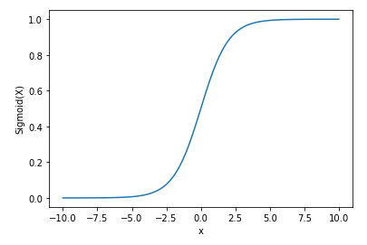

If we feed an output value to the sigmoid function, it will return the probability of the outcome between 0 and 1. If the value is below 0.5, then the output is return as No/Fail/Deceased (above example). If the value is above 0.5, then the output is returned as Yes/Pass/Deceased.

Assumptions of Logistic regression:

- Independent variables show a linear relationship with the log of output variables.
- Non-Collinearity between independent variables. That is, independent variables are independent of each other.
- Output variable is binary.

### Implementing Logistic Regression in Python:

Import dataset [here](https://drive.google.com/file/d/1YUqZOl8S6aTDRxcfmycAAA1dv8LfNrVN/view?usp=sharing) 

1. Import the Libraries needed for creating the model:

2. Import the dataset to the notebook:

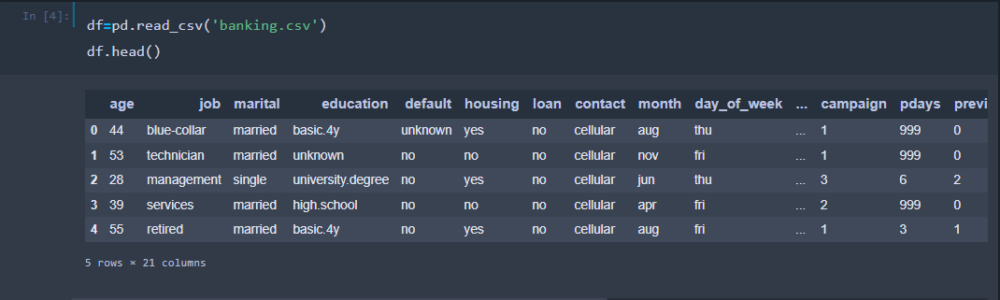

3. Display the columns Independent Vs. Dependent variables:

**Dependent Variables:** Y

**Independent Variables:**
 ‘age', 'job', 'marital', 'education', 'default', 'housing', 'loan','contact', 'month', 
'day_of_week', 'duration', 'campaign', 'pdays','previous', 'poutcome', 'emp_var_rate', 'cons_price_idx','cons_conf_idx', 'euribor3m', 'nr_employed'

### Exploratory data analysis:

Histogram shows the distribution of age within the dataset.

Most members are between ages 25 and 40.
 
Percentage of subscriptions by job type:

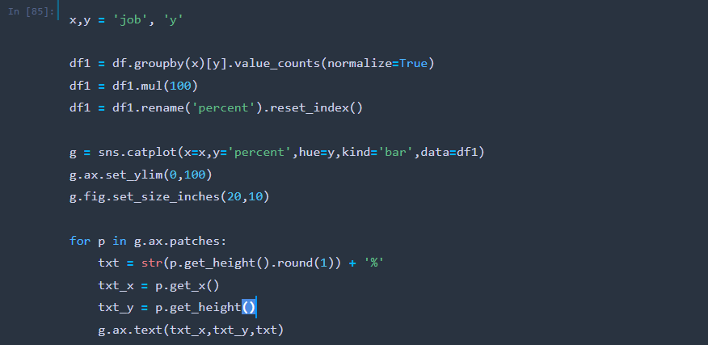

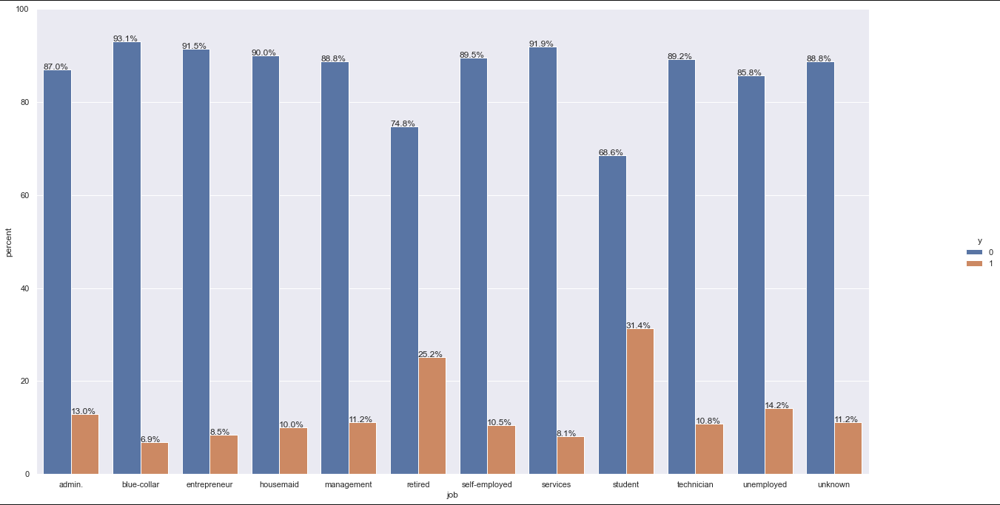

Students (31%) and retired (25%) individuals show the highest percentage of subscriptions.

Percentage of subscriptions by marital status:

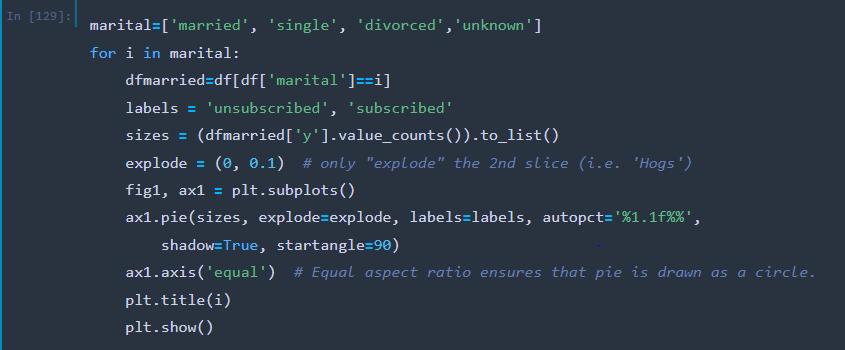 

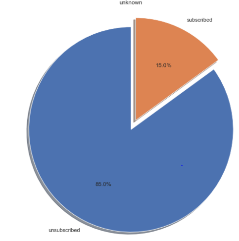

Compared to married (10.2%) or divorced (10.3%), single (14%) individuals show a higher subscription rate.

### Time series

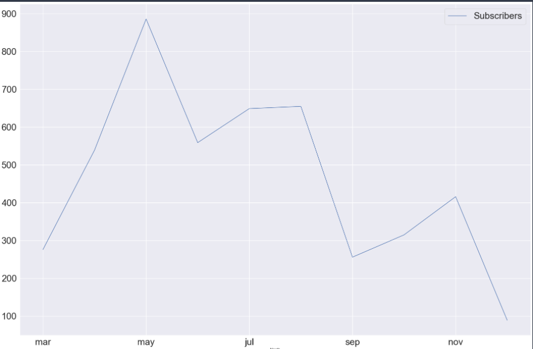

Subscriptions are higher during May and after that the number of members who subscribe decline.

### Logistic Regression Model

1. For categorical variables, we will have to create dummy variables. Creating dummy variables is nothing but assigning a numerical value to each category. And then transforming the rows with categories to multiple columns. Use the below code and then rerun df.head(), you will see more columns have been appended to the right end of the table.

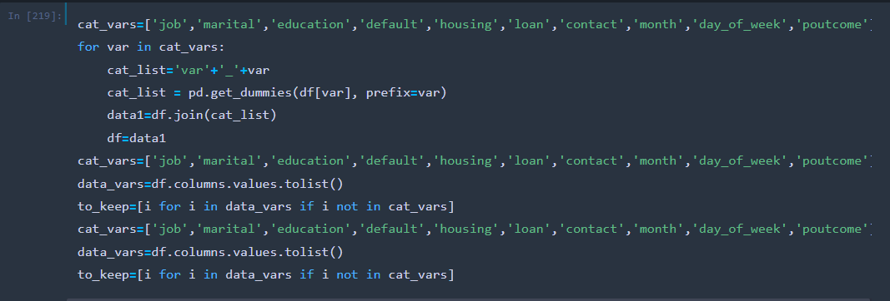

2. Check the outcome variable counts to make sure about the imbalance i.e if outcome variable shows high percentage of one class when compared to other.

It clearly shows that there is a class imbalance in the outcome variable. If we use the same dataset without modifying the sample, it will lead to a poor predictive model. Though there are many methods to resolve the class imbalance problem, we will be using SMOTE here.

### Synthetic Minority Oversampling Technique (SMOTE):

Smote sampling method creates synthetic samples from the minority (class with low records) class. The samples are created using K-nearest neighbors (we will talk about this in upcoming modules).

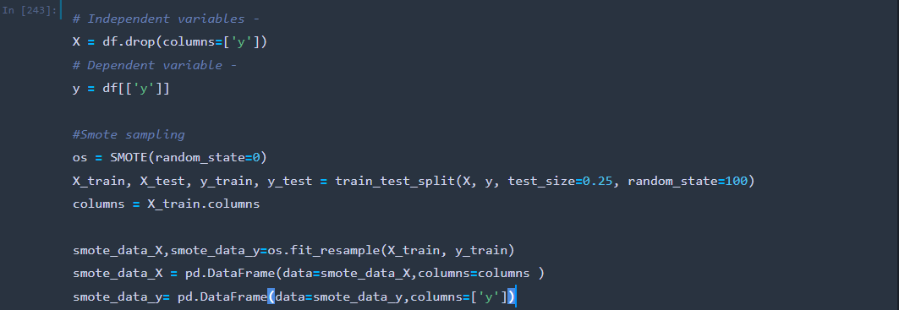

Let’s look at the smote datasets:

Compare the class counts in the original dataset and SMOTE dataset:

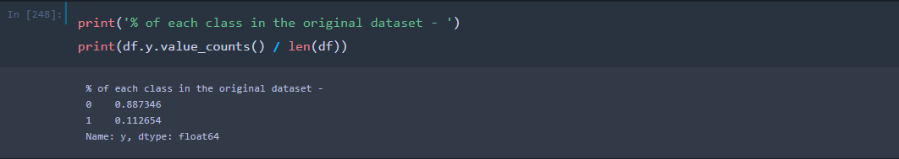

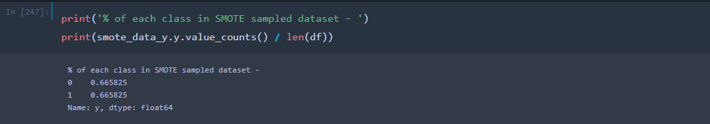

3. **Important Features:**

Our dataset shows more than 73 features to predict the subscription. Now, as not all the feature will be contributing towards the prediction, we need to first figure out the most important features that will contribute towards the prediction. This is very crucial to improve the efficiency of the model.

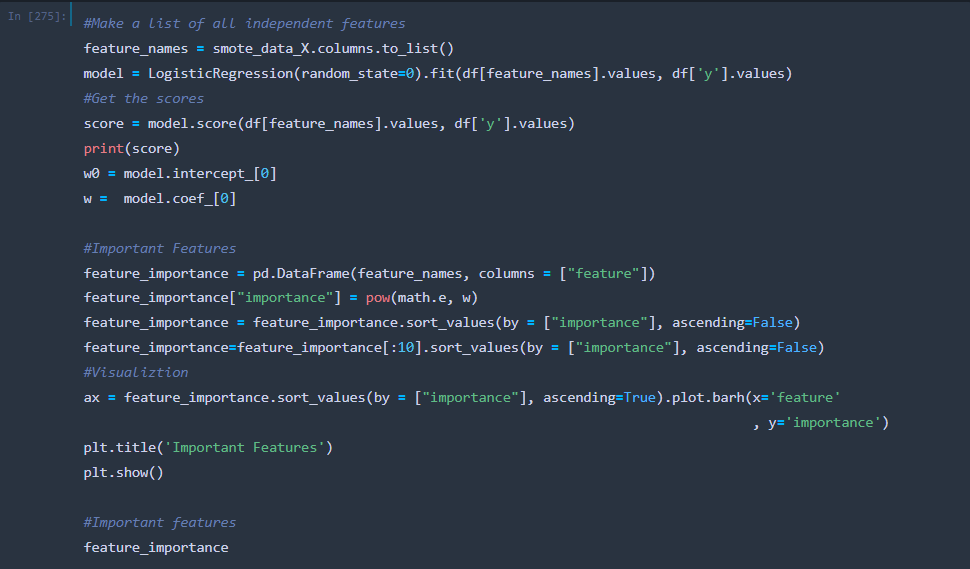

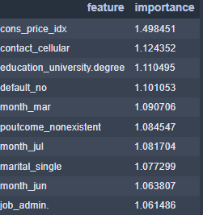

**Model Implementation:**
Split the dataset to test and train data. We create the model on the train dataset and then test it on the test dataset.

Focus on the P values. The most important features show the p values less than 0.05. This shows that these independent variables have a significant impact on dependent variable prediction.

Predict the test dataset:

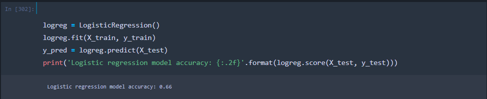

**Model accuracy:** 66%

## Model Evaluation:
Once we create the model. It is very important to evaluate the accuracy of the model to understand whether it is important to implement it or not. ROC curve is one of the important evaluation methods.
ROC curve is a probability curve that plots the True positive rate against the false positive rate. Here, True positive rate is the number of predictions where the model was successful in predicting the outcome correctly.

- If the TPR is closer to 1 that shows that it is a very good model. The model is able to distinguish between positive and negative outcomes correctly.
- If the TPR is 0.5, it shows that the model is as good as a guess. 
- If the TPR is below 0.5, it shows that the model is predicting positive values as negative and negative values as positive. 

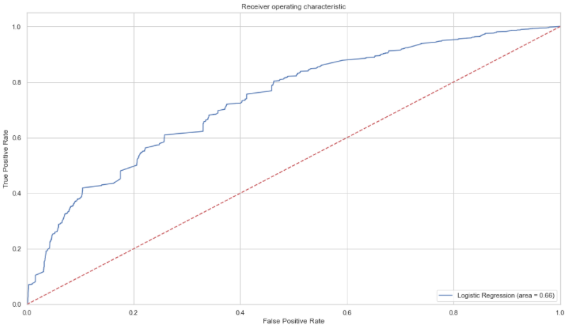