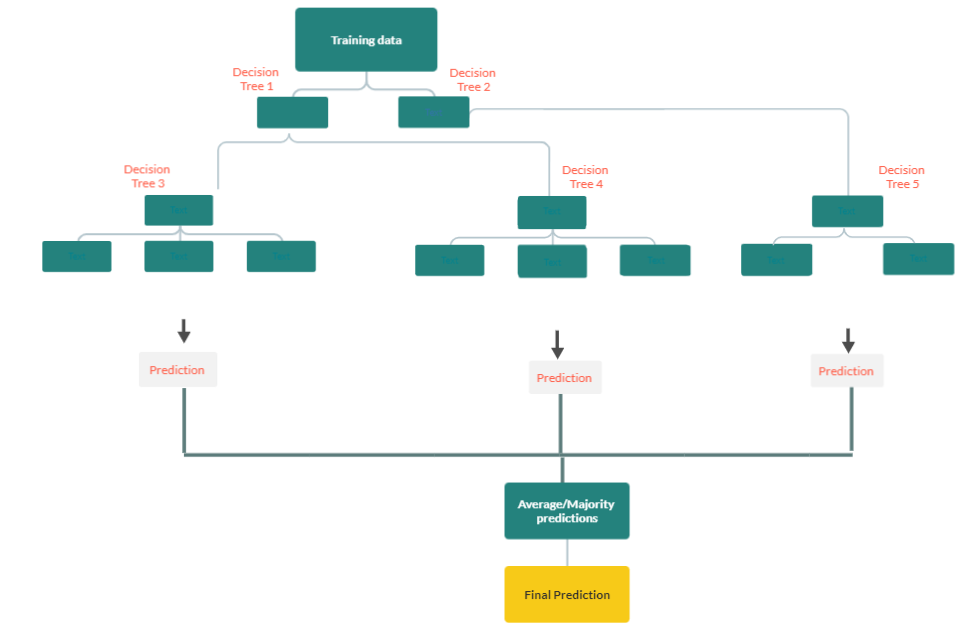

### What is Random Forest?

The Random Forest statistical technique uses an ensemble method to predict the outcome. There are two types of random forest methods:

1. **Random forest regression:** For predicting continuous outcome variables. (Salary, Income, Enrollments, etc.)
2. **Random forest classifier:** For predicting a class label (Yes or No, Active Vs. Lapsed, etc.)

In this module, let us first understand some terms we will use later in upcoming modules.

**Ensemble learning:** The term ensemble means combining multiple model outcomes to predict the final outcome in machine learning. Combining multiple models is a highly efficient method than predicting the outcome using a single model. Some popular ensemble methods include Stacking, bagging, blending etc.

**Stacking:** Stacking is a machine learning process that uses training data, runs multiple models, and generalizes predictions to get the final output. The generalization of the predictions can be of two types.

**Averaging:** In this method, the output from the predictive models is averaged out to get the final prediction.

**Meta-model:** In this method, the output from the predictive models is used as input features for training a Meta-model.

**Bagging:** Bagging, also known as bootstrapping, is an ensemble method in which the train data is run on multiple versions of predictive models and combines the final prediction using averaging process.

**Blending:** Blending is an ensemble machine learning technique that learns how to best combine the predictions that we derive from multiple models. Blending and stacking are usually interchangeable. The only difference is that in stacking, we use two or more base models and a meta-model that either uses the average of all the predictions derived from the model or uses the predictions as input for the meta-model (see stacking above). But in blending, the meta-model is usually a linear regression model (for continuous outcome) or logistic regression (for categorical outcome). Blending uses the weighted sum of the predictions and hence the term blending.

**Regression tree:**
A random forest regression/classification tree is an ensemble machine learning algorithm. It starts with running the regression/classification tree algorithm on several subsets of the training dataset. This addresses the overfitting problem. The algorithm uses the bootstrapping method to pick sample datasets (by replacement) from the original train dataset and runs the data thru the decision trees to get the predictions. The final predictions are either the majority predictions or the average of all the predictions made by decision trees.

Module 6 will include details on how to use python to predict the outcome using random forest regression.
