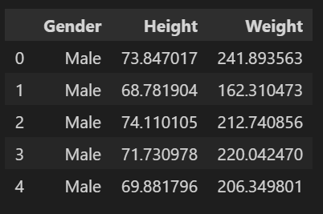
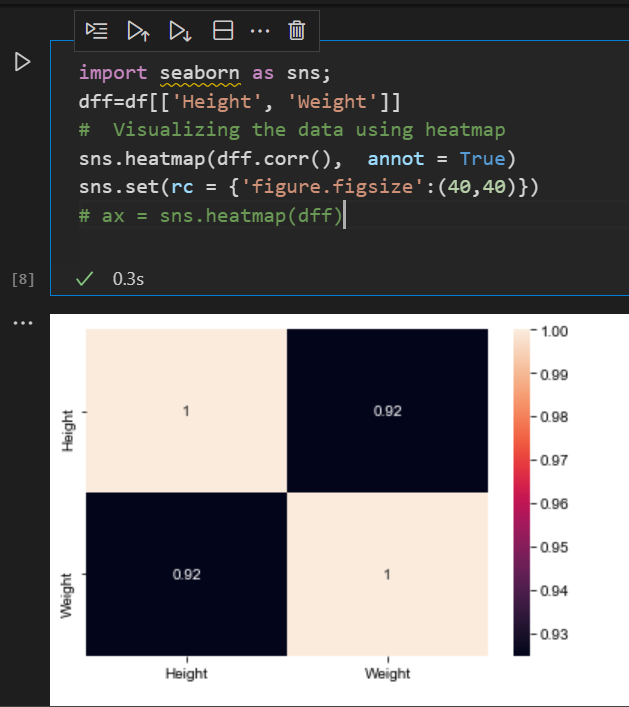
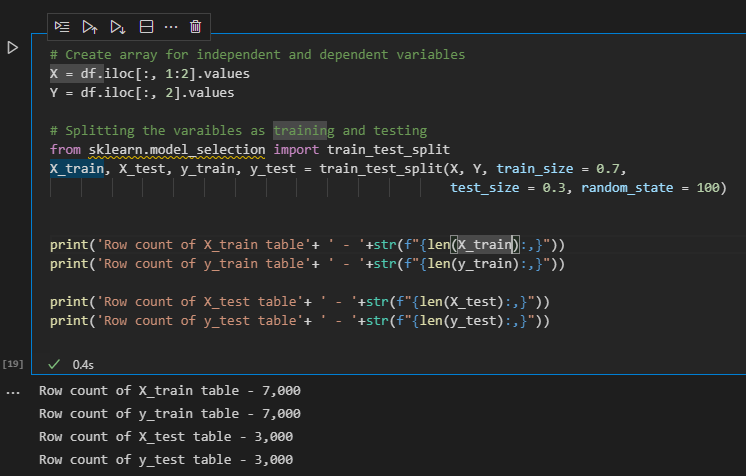
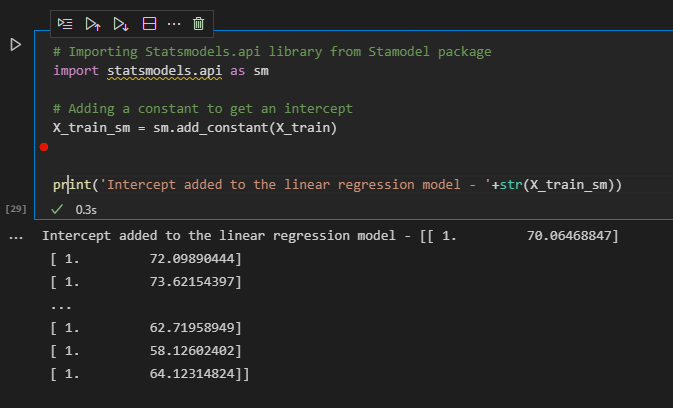
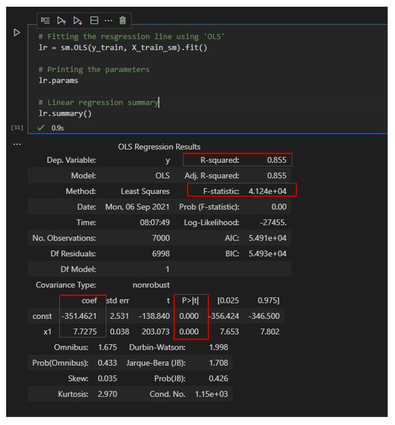

## Process

### Data Science project
Typically, before starting any data science project, we need data to perform analysis and build a model on. Though in the real world you will need to first understand the business need and collect the data, we are providing the data for you in this module. Please use this dataset for next steps. 

### 1. Importing the Dataset
Let us import the data set and load it onto the Jupyter notebook. You can use the online python editor available on the learning content page.

### 2. Reviewing the Dataset
We can review the dataset by looking at the first few rows of data. You can do that by using the head function in python. It helps provide an idea about the data structure

## Exploratory data analysis

Before building any model, it is very important to understand the data set we are working on. EDA (exploratory data analysis) is a crucial step in building any successful model. The dataset used for this model is very simple. We are trying to predict the weight of the individual based on their height. So let us first see if there is any correlation between height and weight of the individual.

### Descriptive statistics –
Run sns heatmap plot to check for correlation between dependent and independent variables.

**Dependent variable:** Weight
**Independent variable:** Height

Heatmap is a two-dimensional visual representation of the variables. It is considered as one of the best visual graphical representation when you want to show the complex data. It is comprised of square boxes and x and y axis represent the variables. For correlation, each square box represents the level of correlation between the variable on X axis Vs. variable on Y axis. The annotations shown in each square box represent the correlation value. If you look across the matrix, the correlation value for weight and height is 0.92. which indicates that these variables are highly correlated. Please note that if you look diagonally, the values will always be 1 as you are just comparing the variable with itself.

Regarding correlation:
- Values closer to 1 show high correlation and values closer to 0 show lowest correlation.
- Positive correlation value shows that the variables are positively correlated. For example: taller individuals usually weigh more.
- Negative correlation value shows that the variables are negatively correlated. 

Plot sns pair plot to visually represent the positive/negative correlation between the variables.

So, based on the sns pair plot, the Height is positively correlated to Weight of the individual. Now, let's build a model that will predict the weight of the individual based on the height. Below are the steps to follow  in order to create a model.

### Create, Train and Test datasets

We are first splitting the dataset into train and test data sets. We will be building the model based on the train data set and will test it on the test dataset.

### Build a simple Linear Regression Model

Now, we are ready to build a simple linear regression model. Remember, the regression model predicts the continuous variables only. Like weight, sales, number of births etc. So, we should choose a regression model only when we have continuous dependent and independent variables.

How do we build the model? What packages do we need? 
We will be using existing python packages to build the model.

Below are the packages:
- Sklearn
- Statsmodel

Below is the equation for simple linear regression:

### Add intercept to the model

Statsmodel library that we will be using for building the linear regression model will fit a line for our dataset. Now, let's input the intercept value using the statmodel library.

### Fit the regression line

Now, let’s fit the regression line using the stats model.

## Understand the results

- R-squared value is 0.855. This shows that 85.5% of variance in the weight can be explained by height.
- F statistic is pretty low, which shows that the model fit is statistically significant.
- Coefficient for height is 7.7 and P value is close to 0. This shows that the coefficient is statistically significant.

Based on the summary, we can now derive the linear regression equation using intercept and slope.

**Weight = -351.4621 + 7.7275 * height**

Plot the regression line using the equation:

### Now predict the weight based on the height in test dataset

### What is the r to the power of 2?

Our model still shows that 85% of the variance in the weight can be explained by the height for the test dataset. This score aligns with the training model r2. This indicates that our model is pretty stable even if we use a new dataset.

In this module, we have learnt how to load the dataset and perform simple exploratory data analysis. For a given dataset, if we have a continuous dependent and independent variable, a simple linear regression statistical model can be used to predict the dependent variable. In our next module, we will learn more about what residuals are, how to derive them based on our model and the importance of residuals in building a model.
