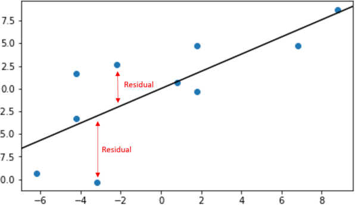
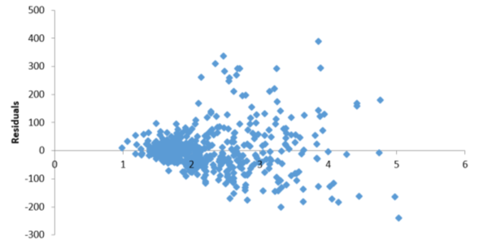

## Module 3

### What is a Residual value?

So, you have learned in Module 2 that we use algorithms to predict the future value based on the factors that impact the outcome. Now, as algorithms accuracy is only 80% – 90% on average, it is understandable that the algorithm will predict as close to the original value as possible. But there is always that residual (gap) between the actual value and expected value. Now, that gap/error in the prediction is called the residual.

**Residual = Original Value – Predicted Value**

**Positive Residual Value:** The residual is positive if the predicted value is less than the actual (original) value.
**Negative Residual Value:** If the expected value is more than the actual value, the residual is negative.

### Residual Characteristics:
- The number of residual values is the same as the total number of actual/predicted values. For example, if we predict the humidity percentage for 50 states, there are 50 actual values for each state. Corresponding to the actual values, we will have 50 predicted values. As the formula for determining the residual value is subtracting the predicted value from the actual value, the total number of residual values will be 50.
- The mean value of the residuals should always be zero.
- If you add all the residuals, the sum of the residuals will be zero.
- Residuals should show a random distribution and should follow a bell-shaped pattern.

Now that we have seen how to calculate the residuals and the residual characteristics, let us understand why we need to check the residual?
  
- An adequate model residuals should not show any patterns.
- If the residuals show any patterns, that indicates that the model needs improvement.
 
### Test for Residual Normality

**Residual plots:** The residuals are plotted for linear regression models. These plots will tell us if we used a suitable model to analyze the data and also if there are any additional issues with the data that we need to address.
 
The residual plot looks like the variance is the same across, and we don’t see any patterns.

There are multiple things to learn from the residual plot below. Firstly, we see a curve pattern, which indicates a nonlinear relationship in the original data. That shows that we need to consider a different statistical model for this data as the dependent and the independent variables show a nonlinear relationship. Secondly, the vertical spread indicates that we need to use a higher-order term or a transformation for the predictor variable.

The below graph shows a funnel-shaped residual plot. This shows the residual value increases as the predicted value increases. It violates the assumption of equal variance.

Now that we have covered the basics on residuals, we will be including the residual plot checks on models we will create to understand the underlying issues with the data and the algorithms we use for building the models.
